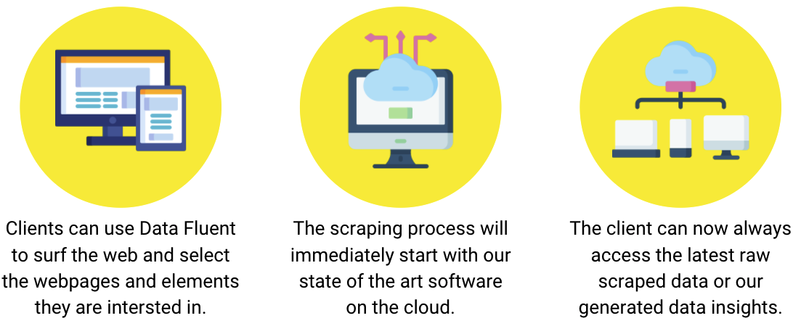
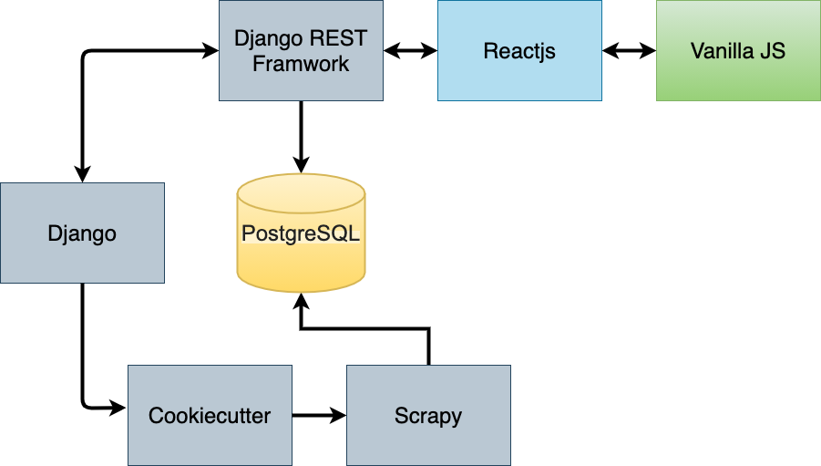

===================================
Introduction
===================================

What is Data Fluent?
=================================

In short: A no-code web scraping tool to easily stay ahead of the competition by monitoring any market
and generating valuable business insights.

This tool is being build as a way for companies and/or universities to easily scrape content from any
website they like. So for example a recruitment firm can use it to stay ahead of the competition to
always be the first to know when a company posts a new job listing to their own website because they
created a scraper that monitors this. Or an AI company or University faculty can use this to scrape
a lot of websites 24/7 to create their models.

Read more about |new_tab_link|.

.. |new_tab_link| raw:: html

   <a href="https://www.linkedin.com/company/data-fluent" target="_blank">Data Fluent</a>

How it works
=================================

Project Architecture
=================================

Process Steps
#############

1) Open the software tool in the React frontend wrapper

2) Select/Annotate DOM elements you want to be scraped

    - These changes are communincated via Django REST Framework

3) These settings are then saved to the database

4) Cookiecutter then gets triggered and generated static scarping script

5) The data the script scrapes is then stored in the database when they are ran

The Goal of this Project
=================================

The main Data Fluent repository is not public, that's why I am creating improvements for the
main project in this repository. These are the improvements I am implementing:

- Optimise Regex operations by using Google's RE2 library as backend

- Unit testing

- Investigating Websockets as an alternative to REST APIs

- CI/CD by leveraging Github Actions

- Git improvements:

    - Cleared git messages
    - Branching

What does this achieve?
=================================

- The main repository is very large and has a lot of functionalities, and this 'Upgrade' repository will make it a lot more maintainable by:

    - Unit testing
    - CI/CD
    - Branching

- A huge optimisation in scraping speed when the final project gets released, by using RE2.

- Shorter data transmission and higher backend-frontend communication by utlising websockets.
