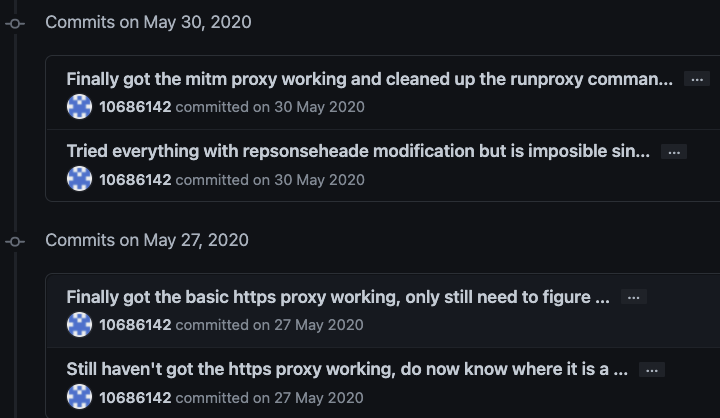
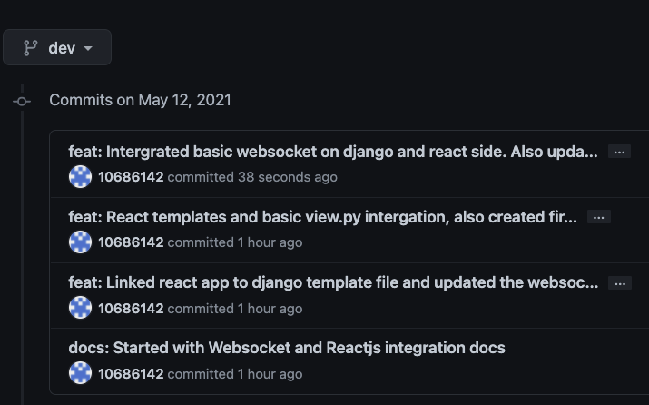

===================================
Maintainability
===================================

CI/CD
=================================

This course I have started with my first CI/CD pipelines, which I intergrated with Github Actions.
I prefer Github actions over Travis, because of:

    - Easy intergation within Github itself
    - Priced better
    - Flow of .yml is chronologically structered

This is a snippet the Github Actions yaml file I created for this repository:

Git Improvements
=================================

Within this course, I have mastered the art of git and have mostly improved in:

    - More descriptive git messages
    - Using a standard format for git messages
    - Branching
    - Tagging and thereby creating releases.

Here you can see an example of how my commit messages looked like before I took this class:

These are my commit messages (including another branch) now:

I am planning to use tagging and semantic versioning when I am close to my first production release by the end of the 2021 summer
