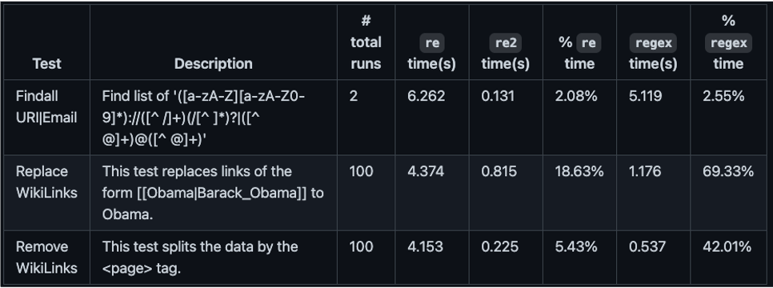

===================================
Regex in C
===================================

What can a C backed for regex achieve?
======================================

We can utilise a RE2 wrapper for linear-time regular expressions in Python. This is achieved by wrapping Google RE2 regular expression library in your project. Implementing this approach can boost your regex performance for heavier tasks up to 50 times.

Find out |new_tab_link|.

.. |new_tab_link| raw:: html

   <a href="https://github.com/andreasvc/pyre2" target="_blank">more</a>

Installation
============

The installation is unfortunately not an easy pip install and you are done. You need make sure to install Cython, build Google's RE2 library from source and then use a wrapper that wraps this library.

1) Install cython with pip

.. code-block:: console

   $ pip install cython

2) Build Google's RE2 library from source in the root of your repo

.. code-block:: console

   $ git clone https://github.com/google/re2.git

   $ cd re2

   $ make

   $ make test

   $ sudo make install

3) Lastly we need install pyre2's repo which will link the backend, the original version does not work so you need to use the forked repo from andreasvc:

.. code-block:: console

   $ pip install -e git://github.com/andreasvc/pyre2.git

Usage
=================================

Use the a conditional when importing re to make sure you can still use the default
::

    try:
        import re2 as re
    except ImportError:
        import re

To get notified when the fallback (default) is triggered use:
::

    try:
        import re2 as re
    except ImportError:
        import re
    else:
        re.set_fallback_notification(re.FALLBACK_WARNING)
