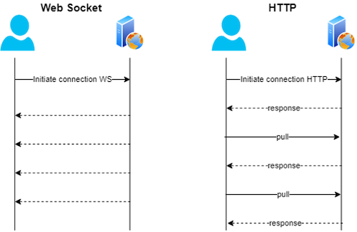

===================================
Web Sockets
===================================

Why use Web Sockets?
=================================

- WebSocket is a low-level protocol based on the concept of socket and port, which are the underlying transport mechanism, whereas REST is based on CRUD operation.
- WebSocket requires the use of IP address and Port details, which are lower-level details for any application, whereas RESTful application needs to design operation based on verbs and HTTP based.
- WebSocket is bi-directional in nature, i.e. both way operation from client to server and vice versa is possible, whereas REST follows a uni-directional approach.
- Short data transmission and higher performance
- Django 3.0 natively supports socket communication

Reactjs Intergation
=================================

I have forked a django react library, so I can modify the code and manage any customization.
I also forked this library due to it's compatibility with a newer create-react-app verions.

Intergration Steps
##################

#. Copy over (or create an app yourself) the reactjs application folder to your project's root. It's called 'frontend_react'
#. Copy over the react_helper into your Django project's root directory.
#. Open your settings.py file and add this app BEFORE 'django.contrib.staticfiles':

    ::

        INSTALLED_APPS = [
            ...........
            'react_helper', # Needs to be before staticfiles
            'django.contrib.staticfiles',
            '..........
        ]

#. Add the constant 'REACT_APPNAME' to your settings.py and specify the name of the react project folder:

    ::

        # The name of the folder containing the CRA project files,
        # relative to the base directory of the Django project (the folder containing manage.py):
        REACT_APPNAME = 'frontend_react' # Name of the React project inside our Django project

#. Open a second terminal and move into the react directory and start the create-react-app (assuming you have npm and yarn installed):

    .. code-block:: console

       $ cd react_frontend

       $ yarn start

#. Inside your main terminal, which is still at the root of your django project, start the server:

    .. code-block:: console

       $ python manage.py runserver

#. Lastly, validate from the terminal console outputs if the intergration went well, and that your Django application is aware that the React app is running.

    - This way Django know when to use the 'hot-reload' functionality of the react app. If react app server isn't running, then helper app will serve the build js and css files for when you have ran 'yarn build'.
    - Check to see if it outputs 'INFO:root:React liveserver is running':

    .. code-block:: console

        (upgrade_data_fluent) vascomeerman@vascos-mac-mini upgrade_data_fluent % python manage.py runserver
        INFO:root:http://localhost:3000
        INFO:root:React liveserver is running at: http://localhost:3000
        Watching for file changes with StatReloader
        .........

Websocket Communication
=================================

Here I will show how you Django application open a socket with the react app and do a basic data transfer.
